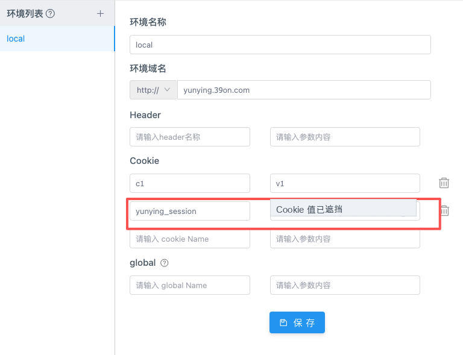
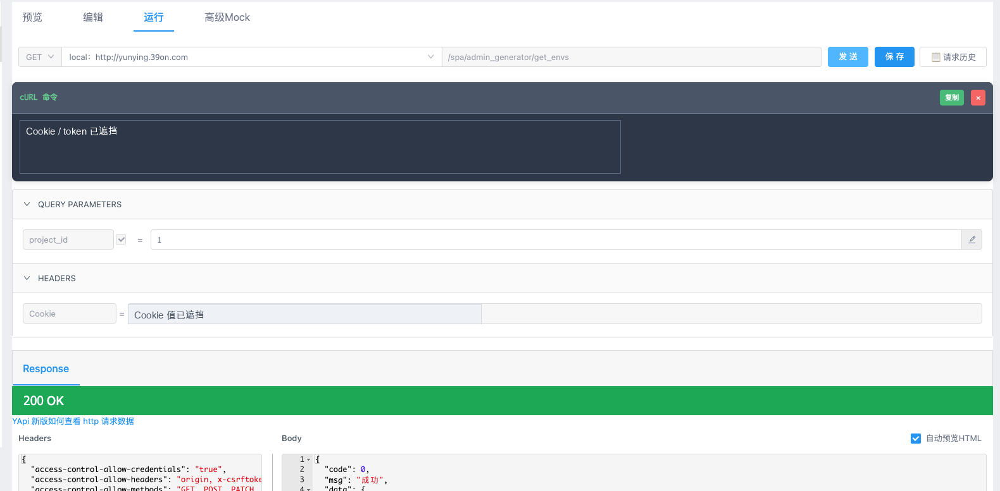
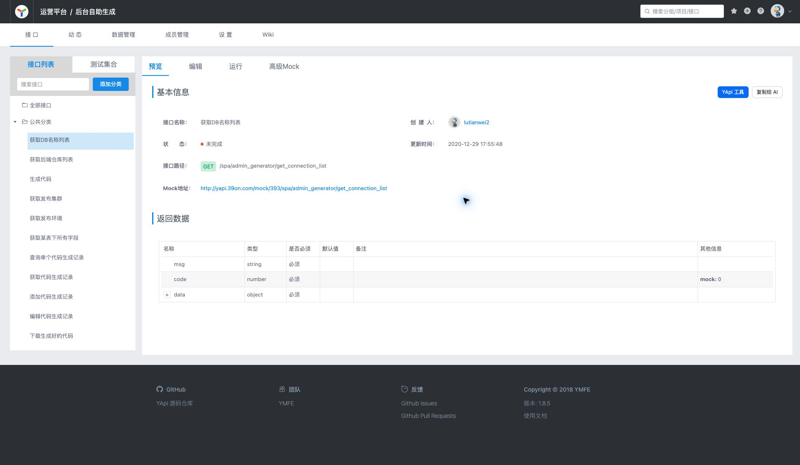
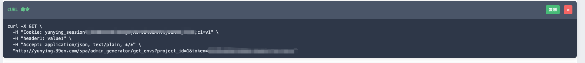

# Cross Request Master

Cross Request Master 是一个面向 YApi 和接口调试场景的 Chrome 扩展。它把页面里的请求转交给扩展后台发送，用来绕过普通网页环境下的 CORS 限制，并在 YApi 页面增强请求调试、cURL 复制、路径参数填写、请求历史和接口信息复制能力。

## 功能概览

- 跨域请求：YApi 运行页请求由扩展后台代发，减少普通网页环境下的 CORS 阻断。
- YApi 运行页增强：发送请求时自动生成 cURL，并尽量以内嵌面板显示在 URL 行下方。
- 路径参数引导：接口路径包含 `{param}` 时，点击发送会提示填写缺失参数。
- 请求历史：在 YApi 运行页显示最近请求记录，并支持从历史记录复制 cURL。
- 固定 Header：支持按当前 YApi 域名保存公共 Header，后续请求自动合并。
- 复制给 AI：在 YApi 接口详情页把当前接口信息整理为 Markdown 后复制到剪贴板。
- YApi 工具箱：在接口详情页生成 Skill/MCP 相关安装或配置命令。

## 安装方法

进入项目根目录后执行：

```bash
pnpm install
./build-extension.sh
```

然后打开 `chrome://extensions/`：

1. 开启右上角「开发者模式」。
2. 点击「加载已解压的扩展程序」。
3. 选择项目生成的 `build/` 目录。

如果只是调试源码，也可以直接加载项目根目录；发布或分发时建议使用 `./build-extension.sh` 生成的 `build/` 和 `.artifacts/releases/*.zip`。

## 在 YApi 中使用

安装并启用扩展后，打开 YApi 接口详情页，例如：

`http://yapi.39on.com/project/393/interface/api/3038`

在「预览」页的「基本信息」标题右侧会出现两个按钮：

- `YApi 工具`：打开工具箱，自动生成 Skill 一键安装命令和 MCP 配置片段。
- `复制给 AI`：读取当前接口详情，把接口名称、路径、方法、请求参数、返回结构等整理为 Markdown 并复制。

切换到「运行」页后可以直接点击 YApi 原有的「发送」按钮。扩展会在请求发送前接管调用，并完成这些增强：

- 如果 URL 中还有 `{id}`、`{name}` 这类占位符，会弹出「填写路径参数」窗口，填完后继续发送。
- 发送时会在页面中展示当前请求对应的 cURL 命令，可直接点击「复制」。
- 请求会写入当前项目/接口维度的本地历史，点击「请求历史」可以查看最近记录、展开响应内容、复制历史 cURL。
- 如果当前域名已保存固定 Header，请求发出前会自动合并这些 Header。

YApi 页面通常还会使用当前登录态访问接口文档。扩展会读取页面能访问到的接口信息，但不会把接口内容上传到第三方服务。

### 设置 Cookie 流程

如果目标接口依赖登录态，可以先在 YApi 的项目环境中配置 Cookie：

1. 进入项目的「设置」或「环境配置」页面。
2. 在环境列表中选择要使用的环境，例如 `local`。
3. 填写环境域名，例如协议选择 `http://`，域名填写 `yunying.39on.com`。
4. 在 `Cookie` 区域添加 cookie name 和 cookie value，例如登录态 cookie。
5. 点击「保存」。
6. 回到接口「运行」页，选择刚才配置的环境，再点击「发送」。



请求发出时，YApi 会把环境里的 Cookie 组装进请求 Header。扩展后台收到请求后，会先解析 `Cookie` Header，并通过 `chrome.cookies.set` 写入目标域名，再使用 `fetch` 发起真实请求。这样目标服务能按正常浏览器 Cookie 方式识别登录态。

### 发起请求流程

在接口「运行」页选择环境、填写 query/header/body 后，点击 YApi 的「发送」按钮即可。扩展处理流程如下：

1. 页面桥接逻辑接管 YApi 运行页请求，补全环境域名、路径参数、query 和 Header。
2. 如果 URL 中有未填写的 `{param}`，先弹出路径参数填写窗口。
3. 生成当前请求的 cURL，并展示在 URL 输入区域下方。
4. 内容脚本把请求数据转发给扩展后台。
5. 后台过滤浏览器不允许设置的 Header；如果存在 Cookie，则先写入目标域名。
6. 后台使用 `fetch` 发起真实请求，并把状态码、响应头和响应体返回页面。
7. 页面解析 JSON 响应，展示结果，同时把本次请求保存到「请求历史」。



### 页面效果

接口详情页会在「基本信息」右侧注入 `YApi 工具` 和 `复制给 AI`。



 cURL 展示效果：



## 开发与测试

常用命令：

```bash
pnpm install
pnpm test
pnpm lint
pnpm format
./build-extension.sh
```

说明：

- `pnpm test` 使用 Jest 运行 `tests/**/*.test.js`。
- `pnpm lint` 使用 ESLint 检查根目录脚本。
- `pnpm format` 使用 Prettier 格式化根目录的 JS/JSON/MD 文件。
- `./build-extension.sh` 会重新生成 `build/`，并把压缩包输出到 `.artifacts/releases/`。

## 项目结构

```text
.
├── manifest.json              # Chrome Manifest V3 配置、权限、content script、后台脚本入口
├── background.js              # 扩展 Service Worker：代发跨域请求、处理 Cookie/FormData、返回响应
├── content-script.js          # 内容脚本：识别 YApi、注入桥接逻辑、渲染 YApi 工具按钮和弹窗
├── index.js                   # 页面桥接逻辑：接管 YApi 请求、显示 cURL、整理响应
├── popup.html                 # 扩展弹窗页面
├── popup.js                   # 弹窗逻辑：显示状态、打开问题反馈入口
├── jquery-3.1.1.js            # 兼容历史页面使用的 jQuery 文件
├── src/helpers/               # 可复用 helper
│   ├── body-parser.js         # 请求/响应体转换
│   ├── fixed-headers.js       # 固定 Header 的存储、归一化、合并
│   ├── form-data.js           # FormData/File/Blob 序列化辅助
│   ├── logger.js              # 安全日志和大响应截断
│   ├── path-params.js         # URL 路径参数提取与替换
│   ├── query-string.js        # 查询字符串处理
│   ├── request-headers.js     # 请求头过滤，移除 fetch 不允许设置的 Header
│   ├── response-handler.js    # 响应对象整理
│   ├── yapi-doc-immersive.js  # YApi 文档型接口的沉浸式展示判定
│   └── yapi-openapi.js        # YApi OpenAPI 客户端封装
├── tests/                     # Jest 单元测试
├── types/cross-request.d.ts   # TypeScript 全局类型定义
├── icons/                     # 扩展图标
├── images/                    # README、商店或展示图片
├── build-extension.sh         # 本地打包脚本
├── build/                     # 构建输出目录
└── .artifacts/releases/       # 打包生成的 zip 文件
```

核心调用链：

```text
YApi 运行页
  -> index.js 接管请求并派发事件
  -> content-script.js 转发到 Chrome runtime
  -> background.js 过滤 Header，并按需写入 Cookie
  -> background.js 使用 fetch 代发请求
  -> content-script.js 把结果回传页面
  -> index.js 解析响应、触发回调、保存历史、展示 cURL
```

## 权限说明

扩展使用的主要权限来自 `manifest.json`：

- `storage`：保存扩展配置。
- `tabs`：向页面回传调试信息。
- `cookies`：在需要时把 YApi 环境里的 Cookie 写入目标域，帮助接口请求带上登录态。
- `<all_urls>`：允许扩展后台向任意接口地址发起请求，这是跨域调试能力的基础。

更完整的权限和隐私说明见：

- `PERMISSION_JUSTIFICATION.md`
- `PRIVACY_POLICY.md`

## 常见问题

### 为什么页面 Network 面板看不到请求？

请求由扩展后台的 Service Worker 发出，不一定会出现在当前网页的 Network 面板里。可以打开 `chrome://extensions/`，在本扩展详情中查看 Service Worker 的控制台和 Network。

### 为什么有些 Header 没有生效？

浏览器的 `fetch` 不允许脚本设置 `Cookie`、`Host`、`Origin`、`Referer`、`User-Agent` 等受限 Header。扩展会过滤这些 Header，避免请求失败。
